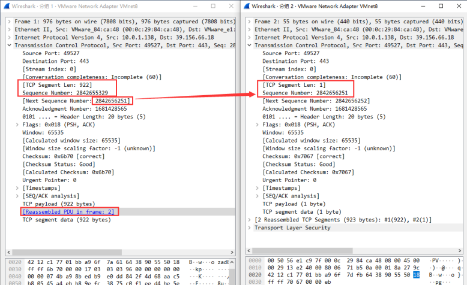
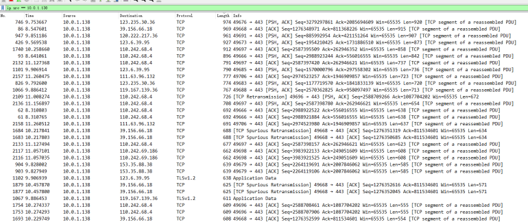

## TLS encrypted traffic shaping technology

## TLS加密流量整形系统

随着TLS 1.3等加密协议及云服务技术的广泛使用，基于明文内容或密文静态特征的识别方法逐渐受限。流量行为特征仍然会体现在带宽、时延、包长、分段和突发模式等侧面，因此可以通过流量整形构造更丰富的加密通信样本，用于数据增强、检测模型测试和网络行为实验。

本项目是一个基于Windows Filtering Platform（WFP）的Windows内核驱动工程，目标是在不解密TLS内容的前提下，从网络栈底层对加密通信流量的外部形态进行调整。工程包含KMDF/WFP驱动、命令行控制程序和MFC图形界面。

​	流量整形原来用于对输出报文的速率进行控制，使报文以均匀的速率发送出去。流量整形通常是为了使报文速率与下游设备相匹配。当从高速链路向低速链路传输数据，或发生突发流量时，带宽会在低速链路出口处出现瓶颈，导致数据丢失严重。这种情况下，需要在进入低速链路的设备出口处进行流量整形。

​	常见的网络场景如下，不同网络场景的流量特征有差别。不同网络环境的mtu大小也有差别。

| **mode**                          | **download rate** | **upload rate** | **rtt** |
| --------------------------------- | ----------------- | --------------- | ------- |
| **mode-1（56K Dial-Up）**         | 49kbps            | 30kbps          | 120ms   |
| **mode-2（Mobile EDGE）**         | 240kbps           | 200kbps         | 840ms   |
| **mode-3（Mobile 2G）**           | 280kbps           | 256kbps         | 800ms   |
| **mode-4（Mobile 3G - Slow）**    | 780kbps           | 330kbps         | 200ms   |
| **mode-5（DSL）**                 | 1500kbps          | 384kbps         | 50ms    |
| **mode-6（Mobile 3G - Typical）** | 1600kbps          | 768kbps         | 300ms   |
| **mode-7（Mobile 3G - Fast）**    | 1600kbps          | 768kbps         | 150ms   |
| **mode-8（Cable）**               | 5000kbps          | 1000kbps        | 28ms    |
| **mode-9（Mobile LTE）**          | 12000kbps         | 12000kbps       | 70ms    |
| **mode-10（FIOS）**               | 20000kbps         | 5000kbps        | 4ms     |

​	WFP，全称Windows过滤框架(英文名：Windows Filtering Platform)，是一套系统API和服务，自Windows Vista系统后继承到操作系统中。WFP采用分层结构，允许开发者在不同层次进行网络数据包的过滤、重定向和修改。开发者可以利用WFP框架实现防火墙、入侵检测系统、网络监视程序和流量控制程序等功能

​	WFP的过滤引擎是其关键，包括用户空间的基础过滤引擎（BFE）和内核空间的过滤引擎两个主要模块。基础过滤引擎（BFE）是一个位于操作系统内核中的关键组件，负责管理和控制网络通信。它通过svchost.exe进程承载用户模式服务，其中包括BFE所需的功能。bfe.dll是BFE的动态链接库文件，提供必要的接口供其他应用程序调用。BFE利用Windows过滤平台（WFP）进行网络数据包的过滤和处理，管理员可以通过配置和设置规则来确保系统的安全性，并允许应用程序之间的有效通信。作为一个过滤器，BFE检查和阻止传入和传出的网络流量，以保护系统免受未经授权的访问和恶意攻击，从而建立一个安全的网络环境。

​	过滤引擎是位于网络堆栈层的关键组件，负责在用户模式层和内核模式层之间包含多个过滤层。通过使用组件间的RPC通信和与IPsec协议的配合，过滤引擎实现对网络流量的分类、过滤和处理。它与传输层的协议（如TCP/IP）进行交互，根据预定义的规则对传入和传出的数据包进行过滤操作。该组件还在分类过程中调用可用的调用函数。过滤引擎包含大约50个内核模式过滤层。

### WFP 设计要点

WFP工程一般由过滤引擎、过滤层、子层、过滤器和Callout组成。过滤器负责匹配指定层上的网络事件，Callout中的`classifyFn`负责处理被命中的数据包，并向WFP返回放行、阻断或继续处理等结果。

本工程主要在MAC帧层和IPv4包层注册Callout。MAC帧层用于较低层的数据包捕获、队列缓存、带宽控制和MAC填充；IPv4包层用于识别TCP数据包并执行TCP分段处理。这样可以把速率、时延和包长控制拆成相对独立的处理链路。

### 驱动初始化流程

驱动入口首先等待WFP/BFE相关组件可用，然后初始化KMDF驱动对象、控制设备对象和IOCTL队列。随后驱动创建网络包注入句柄，初始化包队列和定时器，最后把子层、Callout和过滤器注册到WFP过滤引擎。

初始化过程采用逐步检查的方式：任一阶段失败都会进入清理路径，释放WFP引擎句柄、Callout注册、注入句柄、NET_BUFFER_LIST内存池和队列资源。这种顺序保证驱动加载失败时不会留下半注册的过滤对象。

### 网络数据对象

Windows NDIS 6使用`NET_BUFFER_LIST`、`NET_BUFFER`和`MDL`描述网络数据。一个`NET_BUFFER_LIST`可以包含一个或多个`NET_BUFFER`，每个`NET_BUFFER`再通过`MDL`指向实际数据缓冲区。

本工程的包缓存、重分片和重注入逻辑都围绕这些对象展开。速率控制路径会克隆`NET_BUFFER_LIST`后缓存副本，原始数据包交给WFP拦截；包长改写路径会重新分配`NET_BUFFER`/`MDL`并更新IP、TCP或MAC层相关字段。

### 速率与时延控制

速率控制使用带宽队列记录待发送数据包，并依据时间差和配置带宽计算当前可发送字节数。包进入队列后，驱动拦截原包，等队列调度满足条件后再通过WFP注入接口重新送回网络栈。

RTT模拟在带宽队列之后执行。数据包先通过速率控制，再进入时延队列；当排队时间达到配置的入站或出站延迟后，驱动才执行重注入。这样可以分别调节带宽、缓冲区大小、丢包率和时延参数。

### IP 分片

IP分片用于把超过自定义MTU的数据包拆成多个较小的IPv4分片。驱动会解析MAC头和IP头，检查协议类型、总长度、分片标志和片偏移，然后按8字节对齐要求计算每个分片的payload长度。

分片路径会为新包重新构造`NET_BUFFER_LIST`和`NET_BUFFER`链，复制原始头部与对应payload，并更新`TotalLength`、`Flags`、`FragmentOffset`和IP首部校验和。分片后的数据包仍可继续进入速率和时延控制队列。

### MAC 填充

MAC填充用于把短帧扩展到指定长度范围，补足只通过IP分片无法覆盖的短包场景。实现时驱动不改动上层协议payload长度，而是在底层`NET_BUFFER`可用空间允许时扩展数据长度和`MDL`字节计数。

填充逻辑会遵守自定义MTU和MAC帧长度上限，避免把帧扩展到超出配置范围。与IP分片配合后，工程可以同时覆盖“大包拆小”和“小包补长”两类包长整形需求。

### TCP 分段

TCP分段在IPv4包层执行，用于把满足条件的TCP payload拆成多个非标准MSS长度的分段。驱动会先解析IPv4头部并筛选协议号为`0x06`的TCP数据包，再根据配置范围计算本次分段长度。

每个新分段都需要更新IP总长度、TCP序列号和TCP校验和。TCP校验和计算会构造包含源地址、目的地址、协议号和TCP长度的伪首部，再把伪首部、TCP头和payload一起参与校验。

### 工程目录

- `win-shaper/driver`：KMDF/WFP内核驱动，包含Callout注册、包队列、IP分片、TCP分段和MAC填充逻辑。
- `win-shaper/exe`：命令行控制程序，用于安装、启动、停止驱动并写入整形参数。
- `win-shaper/gui`：MFC图形界面，用于选择网络场景、编辑自定义配置、启停驱动和查看队列状态。
- `win-shaper/bin`：驱动资源和构建输出的引用位置，GUI资源脚本会引用其中的驱动文件。

#### 构建与运行环境

开发环境建议使用Windows 10、Visual Studio 2019或更新版本，以及匹配系统版本的Windows Driver Kit。驱动调试通常需要测试签名模式或关闭强制签名，并配合WinDbg进行内核调试。

单纯运行控制程序或GUI不需要配置完整编译环境，但加载内核驱动需要管理员权限。启用整形前应确认BFE服务和WFP相关系统组件处于可用状态。

### 研究重点

基于Windows驱动的流量整形技术，主要应用于机器学习模型的数据获取和增强部分。通过使用WFP平台进行流量整形，还可以轻松地构建不同场景下的流量生成框架，从而生成各种具有不同特点的训练数据。

### 研究成果

项目从Windows底层网络栈切入，把WDF驱动、WFP过滤框架、NDIS数据对象和用户态控制界面组合在一起，实现了对加密流量外部行为特征的主动调整。

相较于只在应用层生成样本，本工程可以在更低层改变包长、分段、填充、带宽和时延表现，同时不依赖TLS明文内容。这使它更适合作为机器学习流量识别任务中的数据增强和场景模拟工具。

### 后续方向

后续可以进一步完善入站数据包的低层特征修改，使入站和出站方向都支持更一致的MTU、MSS和padding控制。由于入站流量在抓包位置上可能已经被协议栈重组，验证方式也需要配合更底层的观测手段。

另一个方向是引入更高层的加密通信行为特征，例如HTTP/HTTPS请求节奏、TLS握手阶段特征和应用协议交互模式。底层包形态整形与应用层特征生成结合后，可以构造更贴近真实网络环境的数据集。

### 工程说明：

基于WFP的Windows驱动工程，主要用于流量整形，可以通过调整gui中的参数来控制网络流量的数据包长、速率等

环境配置包括编译开发环境和运行环境，**单纯运行软件不需要配置编译环境**。

### 示例：
如下图，分组1中的SeqNumber为2842655329，分段长度为922，分组2中的分段长度为2842656251，分段长度为1，也就是说我们将一个923长的TLS数据包，拆分成了922和1的两个分段发送。

经过长时间的测试，应用并不会影响正常的通信，而且通过下图的抓包的示意图可以看出，TCP的分段极大调整了网络流量数据包长的分布，同时影响到了TCP会话的行为特征，对数据增强有显著效果。

